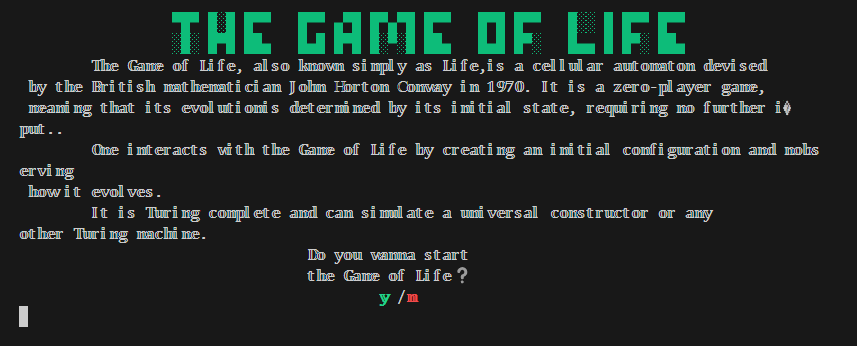
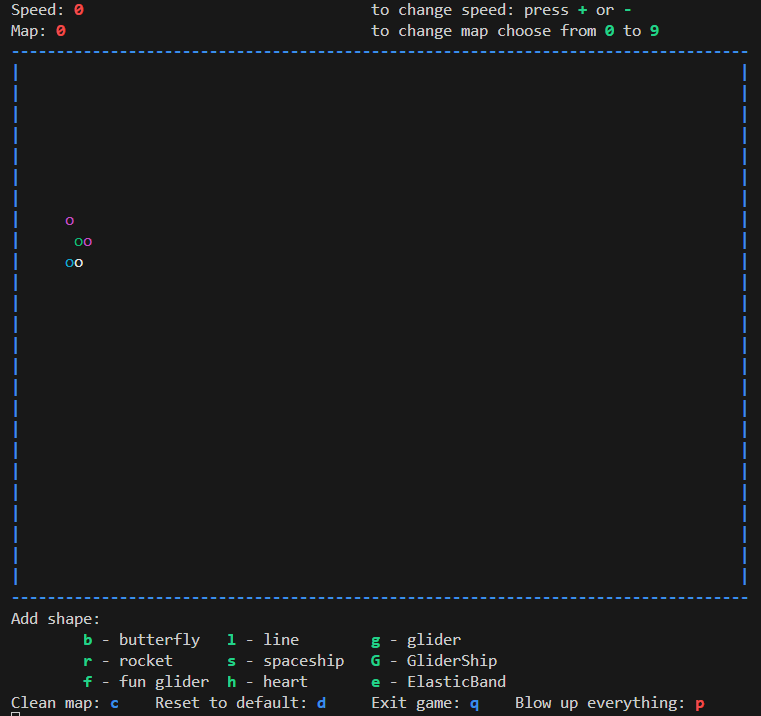
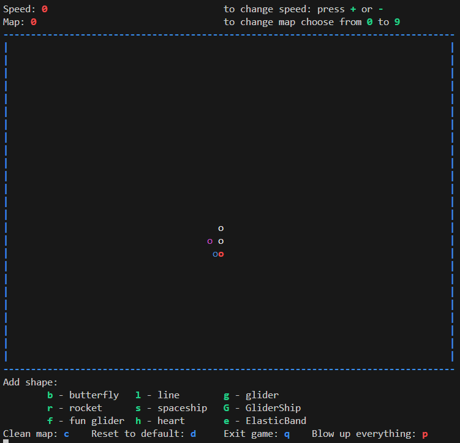
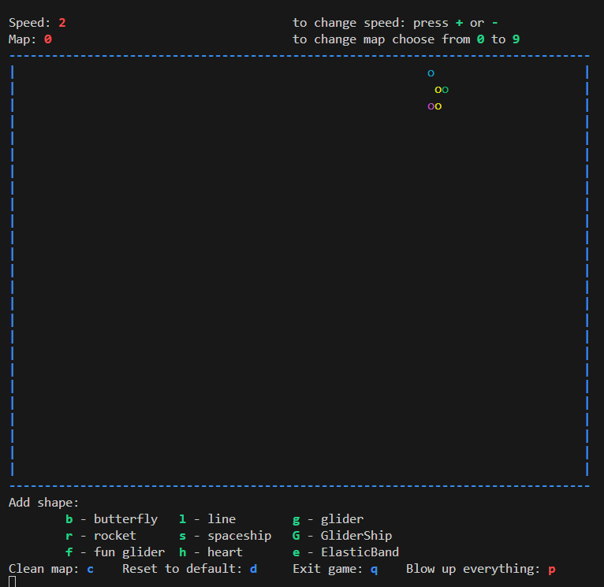
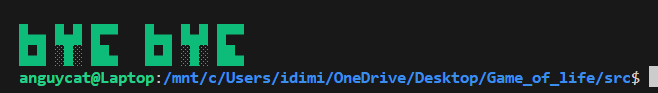

# Game "Life"

## Description

The game "Life" is an implementation of the cellular automaton proposed by John Conway in 1970. It models the evolution of a cell structure based on predefined rules, creating complex patterns and dynamic systems. The player's interaction involves choosing the initial map configuration and observing its evolution.

Rules of the Game "Life":
- "Life" is played on an infinite cellular grid.
- Each cell has 8 neighboring cells.
- A creature can live in any cell.
- A creature with two or three neighbors survives into the next generation; otherwise, it dies from loneliness or overcrowding.
- An empty cell with three neighbors will give birth to a new creature in the next generation.

## Main Code Functionality

### 1. Starting the Game
- When the program starts, the user is greeted and provided with a brief overview of the game.
- The user is prompted to start the game by entering "y" (yes) or "n" (no).


### 2. Map Selection
- The game supports multiple predefined maps (selection from 0 to 9).
- If no selection is made, a default configuration is loaded.


### 3. Controls
- During the game, the following commands are available:

  - `+` / `-` — Increase/decrease simulation speed.
  - `b`, `l`, `g`, and other symbols — Add shapes (e.g., "butterfly," "glider").
  - `c` — Clear the map.
  - `d` — Reset to the default configuration.
  - `q` — Exit the game.
  - `p` — Destroy (explode) all cells.

### 4. Main Loop
- The map is visualized in a text format where active cells are displayed using colored symbols.

- Each simulation iteration checks the neighbors of every cell and updates its state based on the rules:
  - A cell comes to life if it has exactly 3 neighbors.
  - A cell remains alive if it has 2 or 3 neighbors.
  - Otherwise, the cell dies (overcrowding or loneliness).

### 5. Ending the Game
- The user can exit the game at any time by pressing `q`.
    

## Compilation and Execution Instructions

### 1. Requirements
- A C compiler (e.g., GCC).
- The `pthread` library installed for multithreading.
- Support for ANSI escape sequences for colored output.

### 2. Compilation
Compile the code using the following command:
```bash
gcc -o game_of_life game_of_life.c -lpthread
```

Or use the Makefile in the `src` directory:
```bash
make run
```

### 3. Execution
Run the compiled file:
```bash
./game_of_life
```

### 4. Map Files
Predefined maps should be located in the folder `./code/maps/` and named `map1.txt`, `map2.txt`, and so on. File format:
- The character `1` represents an active cell.
- A space (`0`) represents an empty cell.

Example:
```
     
  *  
 *** 
  *  
     
```

### 5. Interrupting
To exit the game, type `q` during execution.

## Main Structure of `game_of_life.c`
- **`main`**: Entry point. Handles greeting, story, map selection, and the main game loop.
- **`checkMap`**: Checks cell neighbors and applies game rules to update the map.
- **`readmap`**: Loads the initial map configuration.
- **`GameRender`**: Displays the map and provides control instructions.
- **`control_thread_func`**: Processes real-time user input.
