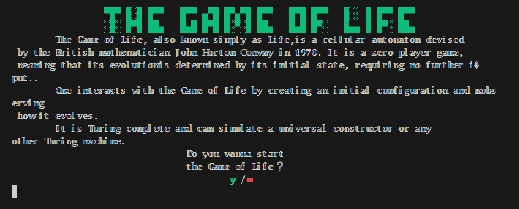
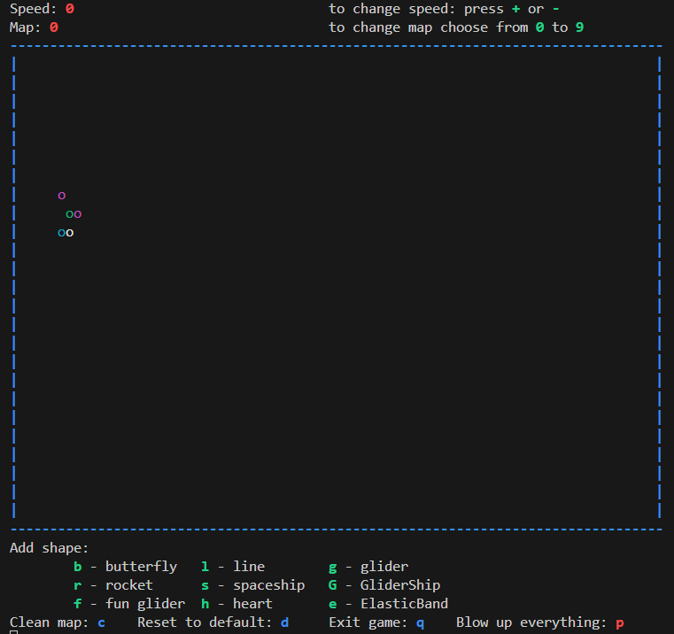
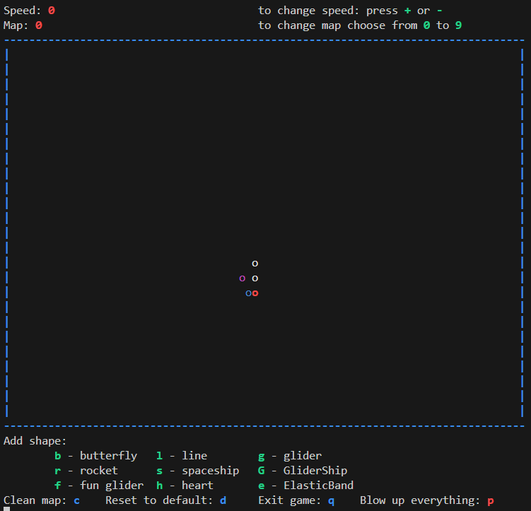
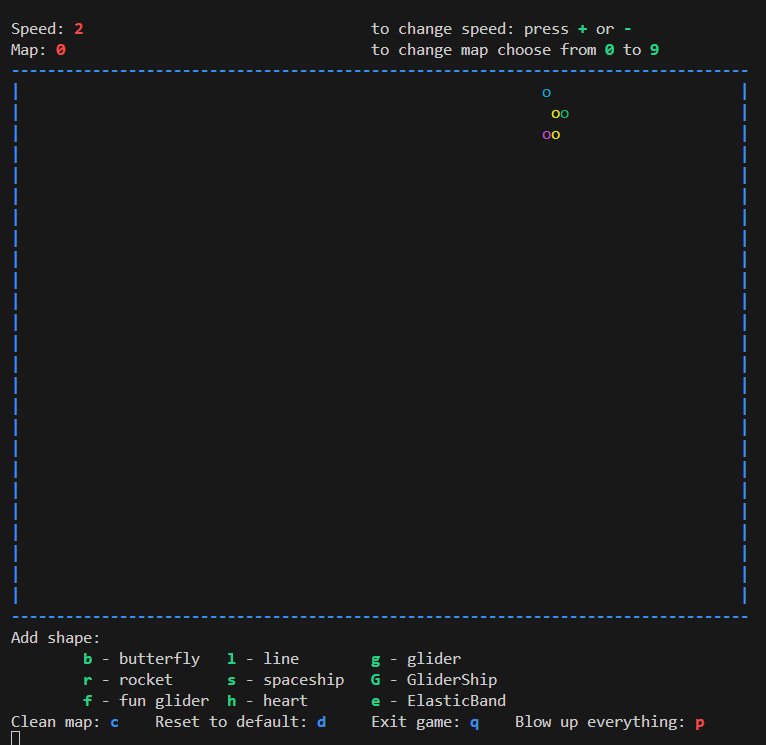
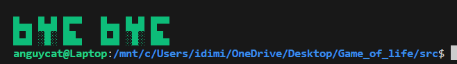

# Game "Life"

Terminal implementation of Conway's Game of Life: a cellular automaton from 1970 where you pick a starting map and watch generations evolve. The program uses a separate thread for non-blocking controls and colors the grid in the terminal.

**Stack:** C, GCC, POSIX threads (`pthread`), GNU Make, clang-format (Google style), ANSI escape sequences (colored output).

## Table of contents

1. [Project structure](#project-structure)
2. [Description](#description)
3. [Main code functionality](#main-code-functionality)
4. [Compilation and execution instructions](#compilation-and-execution-instructions)
5. [Main structure of game_of_life.c](#main-structure-of-game_of_lifec)
6. [CI/CD](#cicd)

---

## Project structure

```text
Game_of_life
├── LICENSE
├── README.md
├── README_RUS.md
├── .gitignore
├── helpers/                 # screenshots and GIFs for the README
│   ├── start.png
│   ├── maps.gif
│   ├── menu.png
│   ├── preview.gif
│   └── bye.png
└── src/
    ├── makefile             # build and run targets
    └── code/
        ├── game_of_life.c   # main source
        ├── game_of_life.h
        ├── .clang-format
        └── maps/            # predefined boards map1.txt … map9.txt
            └── map*.txt
```

---

## Description

The game "Life" is an implementation of the cellular automaton proposed by John Conway in 1970. It models the evolution of a cell structure based on predefined rules, creating complex patterns and dynamic systems. The player's interaction involves choosing the initial map configuration and observing its evolution.

Rules of the Game "Life":

- "Life" is played on an infinite cellular grid.
- Each cell has 8 neighboring cells.
- A creature can live in any cell.
- A creature with two or three neighbors survives into the next generation; otherwise, it dies from loneliness or overcrowding.
- An empty cell with three neighbors will give birth to a new creature in the next generation.

---

## Main code functionality

### 1. Starting the Game

- When the program starts, the user is greeted and provided with a brief overview of the game.
- The user is prompted to start the game by entering "y" (yes) or "n" (no).



### 2. Map Selection

- The game supports multiple predefined maps (selection from 0 to 9).
- If no selection is made, a default configuration is loaded.



### 3. Controls

- During the game, the following commands are available:



  - `+` / `-` — Increase/decrease simulation speed.
  - `b`, `l`, `g`, and other symbols — Add shapes (e.g., "butterfly," "glider").
  - `c` — Clear the map.
  - `d` — Reset to the default configuration.
  - `q` — Exit the game.
  - `p` — Destroy (explode) all cells.

### 4. Main Loop

- The map is visualized in a text format where active cells are displayed using colored symbols.



- Each simulation iteration checks the neighbors of every cell and updates its state based on the rules:
  - A cell comes to life if it has exactly 3 neighbors.
  - A cell remains alive if it has 2 or 3 neighbors.
  - Otherwise, the cell dies (overcrowding or loneliness).

### 5. Ending the Game

- The user can exit the game at any time by pressing `q`.



---

## Compilation and execution instructions

### 1. Requirements

- A C compiler (e.g., GCC).
- The `pthread` library installed for multithreading.
- Support for ANSI escape sequences for colored output.

### 2. Compilation

From the `src` directory, compile with:

```bash
cd src
gcc -o game_of_life code/game_of_life.c -lpthread
```

Or use the Makefile in the `src` directory:

```bash
cd src
make run
```

### 3. Execution

Run the compiled binary from `src` (after `make` or `gcc` as above):

```bash
./game_of_life
```

### 4. Map Files

Predefined maps should be located in the folder `./code/maps/` (relative to the `src` working directory) and named `map1.txt`, `map2.txt`, and so on. File format:

- The character `1` represents an active cell.
- A space (`0`) represents an empty cell.

Example:

```
     
  *  
 *** 
  *  
     
```

### 5. Interrupting

To exit the game, type `q` during execution.

---

## Main structure of game_of_life.c

- **`main`**: Entry point. Handles greeting, story, map selection, and the main game loop.
- **`checkMap`**: Checks cell neighbors and applies game rules to update the map.
- **`readmap`**: Loads the initial map configuration.
- **`GameRender`**: Displays the map and provides control instructions.
- **`control_thread_func`**: Processes real-time user input.

---

## CI/CD

There are no GitHub Actions or other automated pipelines in this repository; build and checks are run locally (`make`, `make check` for `clang-format`).
