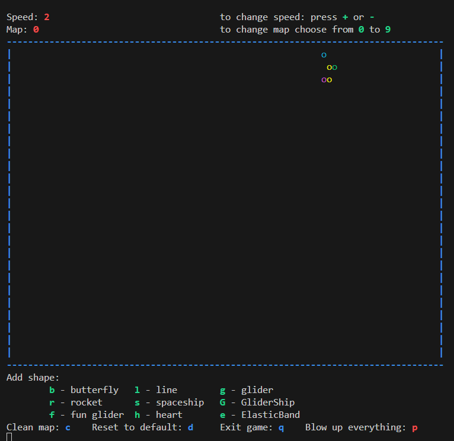

# Игра "Жизнь"

## Описание

Игра "Жизнь" представляет собой реализацию клеточного автомата, предложенного Джоном Конвеем в 1970 году. Она моделирует эволюцию клеточной структуры на основе заданных правил, создавая сложные паттерны и динамические системы. Взаимодействие игрока заключается в выборе начальной конфигурации карты и наблюдении за её развитием.

Правила игры «Жизнь»
- «Жизнь» разыгрывается на бесконечном клеточном поле.
- У каждой клетки 8 соседних клеток.
- В каждой клетке может жить существо.
- Существо с двумя или тремя соседями выживает в следующем поколении, иначе погибает от одиночества или перенаселённости.
- В пустой клетке с тремя соседями в следующем поколении рождается существо.

## Основной функционал кода

### 1. Старт игры
- При запуске программы пользователь приветствуется и получает краткую информацию об игре.
- Предлагается начать игру, вводя "y" (yes) или "n" (no).


### 2. Выбор карты
- Игра поддерживает несколько предопределённых карт (выбор от 0 до 9).
- При отсутствии выбора по умолчанию загружается стандартная конфигурация.


### 3. Управление
- В процессе игры доступны следующие команды:

  - `+` / `-` — Увеличение/уменьшение скорости симуляции.
  - `b`, `l`, `g` и другие символы — Добавление фигур (например, "бабочка", "глайдер").
  - `c` — Очистка карты.
  - `d` — Сброс к стандартной конфигурации.
  - `q` — Завершение игры.
  - `p` — Уничтожение (взрыв) всех клеток.

### 4. Основной цикл
- Визуализация карты происходит в текстовом формате, где активные клетки обозначаются цветными символами.

- Каждая итерация симуляции проверяет соседей каждой клетки, изменяя её состояние по правилам:
  - Клетка оживает, если у неё ровно 3 соседа.
  - Клетка остаётся живой, если у неё 2 или 3 соседа.
  - В противном случае клетка умирает (перенаселение или одиночество).

### 5. Завершение игры
- Пользователь может завершить игру в любой момент, нажав `q`.
    

## Инструкции по компиляции и запуску

### 1. Требования
- Компилятор C (например, GCC).
- Установленная библиотека `pthread` для работы с потоками.
- Поддержка ANSI-escape последовательностей для цветного вывода.

### 2. Компиляция
Скомпилируйте код с использованием следующей команды:
```bash
gcc -o game_of_life game_of_life.c -lpthread
```

Или запустите Makefile в директории src
```bash
make run
```

### 3. Запуск
Запустите скомпилированный файл:
```bash
./game_of_life
```

### 4. Файлы карт
Предопределённые карты должны находиться в папке `./code/maps/` и называться `map1.txt`, `map2.txt` и т.д. Формат файла:
- Символ `1` обозначает активную клетку.
- Пробел (`0`) обозначает пустую клетку.

Пример:
```
     
  *  
 *** 
  *  
     
```

### 5. Прерывание
Для завершения игры введите `q` в процессе выполнения.

## Основная труктура кода game_of_life.c
- **`main`**: Точка входа. Запускает приветствие, историю, выбор карты и основной цикл игры.
- **`checkMap`**: Проверяет соседей клеток и применяет правила игры для обновления карты.
- **`readmap`**: Загружает начальную конфигурацию карты.
- **`GameRender`**: Отображает карту и предоставляет инструкции для управления.
- **`control_thread_func`**: Обрабатывает пользовательский ввод в реальном времени.